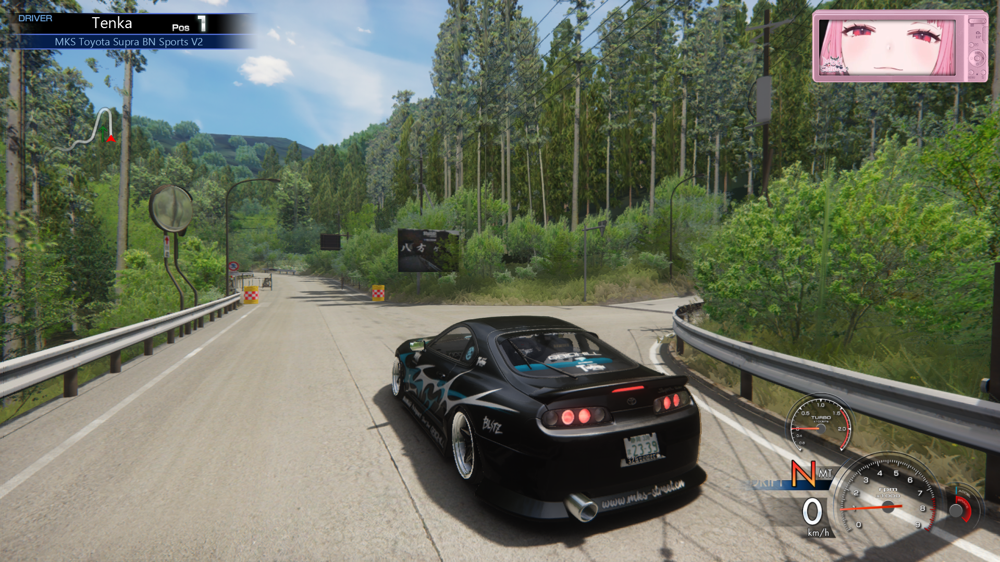
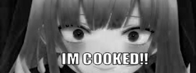
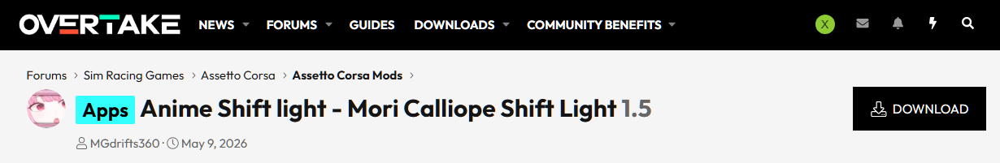
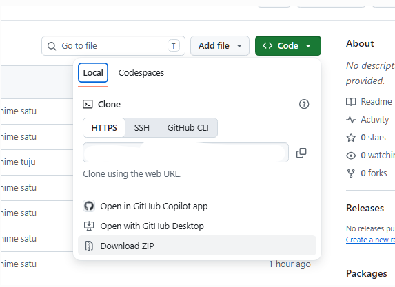
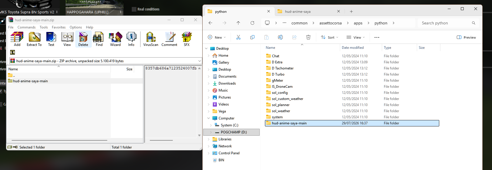
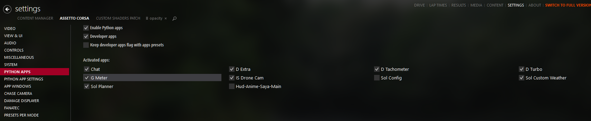

# Assetto Corsa Custom HUD + 'sentuhan pribadi'





---


## Fitur

* **Shift Light Dinamis**: Lampu RPM bakal berubah bertahap seiring naiknya RPM mesin.
  <br>
    ➔   ➔  

* **Mode Mesin Limit (Cooked Light)**: Keluar indikator khusus saat geber RPM melampaui batas aman.
  <br>
  

* **Efek Tabrakan Selang-Seling**: Gambarnya bakal ganti-gantian secara dinamis tiap kali terjadi benturan baru.
  <br>
   &nbsp; ↔ &nbsp; 

* **Efek Getar Mesin (Engine Shake)**: Layar HUD bakal ikut bergetar pas mesin digeber di atas 4000 RPM biar makin terasa sensasinya.

* **Speedometer Digital**: Tampilan angka rata kanan yang rapi, dan satuan kecepatan bisa diganti antara **KM/H** atau **MPH**.

* **Menu Pengaturan di Dalam Game**: Bisa bebas matiin/nyalain fitur lewat jendela *Settings* pas lagi di dalam trek.
---

## Credit & Mod Original

originated dari **Anime Shift Light (Mori Calliope Shift Light)**.

👉 [OverTake.gg - Anime Shift Light (Mori Calliope Shift Light)](https://www.overtake.gg/threads/anime-shift-light-mori-calliope-shift-light.295446/)



---

## Cara donlod

1. **Dapetin Filenya**:
   Code trs 'Download Zip'


2. **Drop / Extract Folder**:
   Langsung masukkan (*drop*) folder hasil download ke direktori Assetto Corsa berikut:
   ```text
   assettocorsa/apps/python/

   ```


3. **Enable mod**
   di SETTINGS -> 'Assetto Corsa' -> python apps -> centang 'hud-anime-saya-main'



